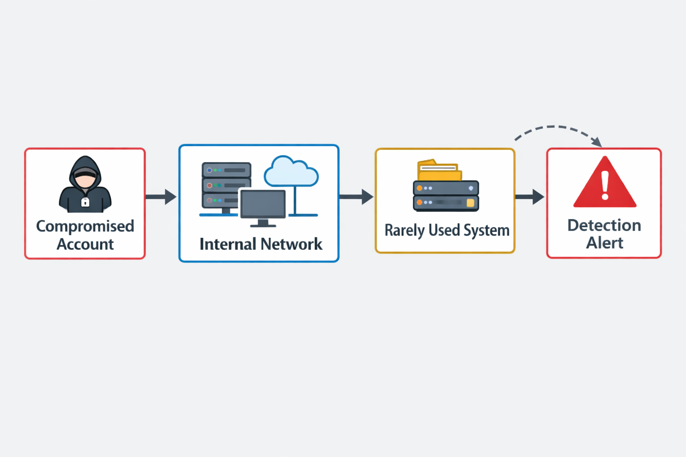

Overview

This project simulates a realistic internal network compromise scenario where an attacker leverages a compromised employee account to move laterally within a trusted internal environment.

The focus of this project is not exploitation, but understanding how trust assumptions inside enterprise networks can fail, and how such failures could be detected.

Attacker Profile

Compromised employee account

Limited privileges

No initial administrative access

Attack Objective

The attacker’s primary goal was to gain access to internal systems that contain higher-value assets, based on the assumption that internal systems are less strictly monitored.

Initial Behavior

Rather than performing noisy actions, the attacker began by observing internal network behavior, identifying:

Rarely accessed systems

Services with low visibility

Access patterns that appeared implicitly trusted

Root Cause of Failure

The organization relied on implicit trust in the internal network, assuming that requests originating internally were safe and legitimate.

This lack of contextual and role-based validation allowed unauthorized access attempts to succeed.

Detection Opportunity

The compromised account accessed internal systems that were rarely used and did not align with the user’s role.

Although the account was active during normal hours, the type of access was anomalous.

Blue Team Detection Strategy

A detection rule could trigger alerts based on:

Role-based access deviations

Unusual access to low-usage internal systems

Behavioral mismatch compared to historical user activity

Purple Team Insight

This simulation highlights how attackers exploit trust boundaries, and how defenders can shift from perimeter-based security to behavior and context-aware detection.

